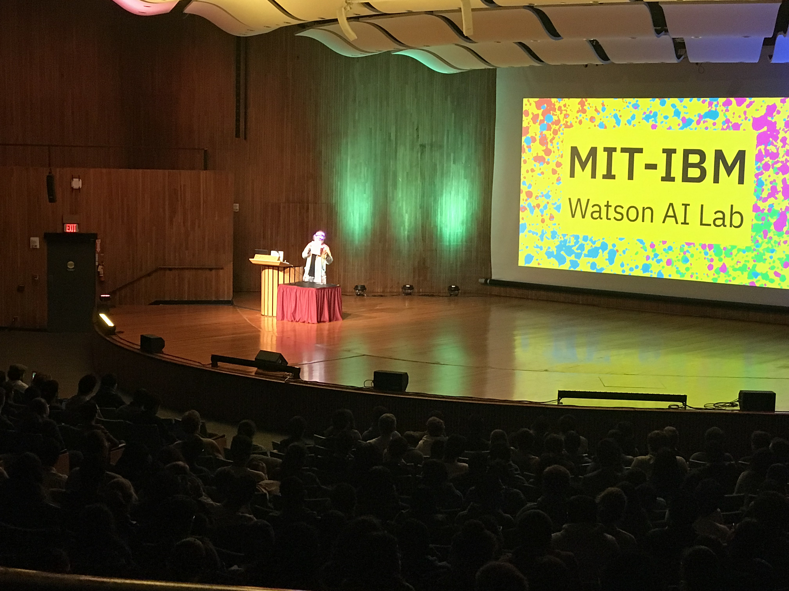

# IBM-at-HackMIT
Information and Resources for HackMIT 2021 participants

IBM is delighted to be a long time sponsor of HackMIT and back in 2021 !



# IBM Challenge

### IBM Challenge prompt:
```
“The impacts of climate change are global in scope and unprecedented in scale. Without drastic action today, adapting to these impacts in the future will be more difficult and costly.” United Nations
```

### Challenge

The **2021 IBM Call for Code Challenge for HackMIT** asks participants to use one or more IBM Cloud services to build sustainable open source solutions that help halt and reverse the impact of climate change, with a focus specifically on:

- **Clean Water and Sanitation** - Water is the natural resource that is most threatened by climate change and a prerequisite for life on earth. From intelligent solutions for small farmers to recycling showers, technology can make a significant impact on the availability of water and its consumption.
- **Zero Hunger** - 135 million people suffer from acute hunger, with climate change a major contributing factor. Technology can help grow more crops in areas on the edge of drought or quickly distribute perishables from small stores to local homeless shelters.
- **Economic Consumption and Production** - Worldwide consumption and production drives the global economy yet is inextricably linked to the environment. Technology can help make recommendations on energy efficiency to highlighting the carbon footprint of online purchases.

### Tech Requirements:
Must use at least one IBM Technology or IBM Cloud service as a part of your solution and call out which IBM Technology being used in your abstracts and/or video.

Sign-up for access to IBM Cloud at https://ibm.biz/hackmit2021

# Prizes


- 1st : $1500
- 2nd : $750
- 3rd : $500

Plus.... TONS of SWAG - stop by the IBM Booth and grab a T-Shirt and free stuff.

# Get Started

- Sign up for a free [IBM Cloud](https://ibm.biz/hackmit2021) account - https://ibm.biz/hackmit2021
- Request a Feature Code for additional services - Visit the IBM Booth
- [Learn about IBM Cloud](https://github.com/upkarlidder/ibmhacks)

# Workshop

Join the IBM workshop on Saturday 10pm ET
- [Zoom link](http://go.hackmit.org/ibm-workshop)

Watch the HackWeek replay:
- 9/13 - HackWeek session - [YouTube replay](https://www.youtube.com/watch?v=BJwak1D6s4U)

# Support

- Ask us in the booth
- Find us on [Slack](https://hackmit2021.slack.com)

# Find this page

